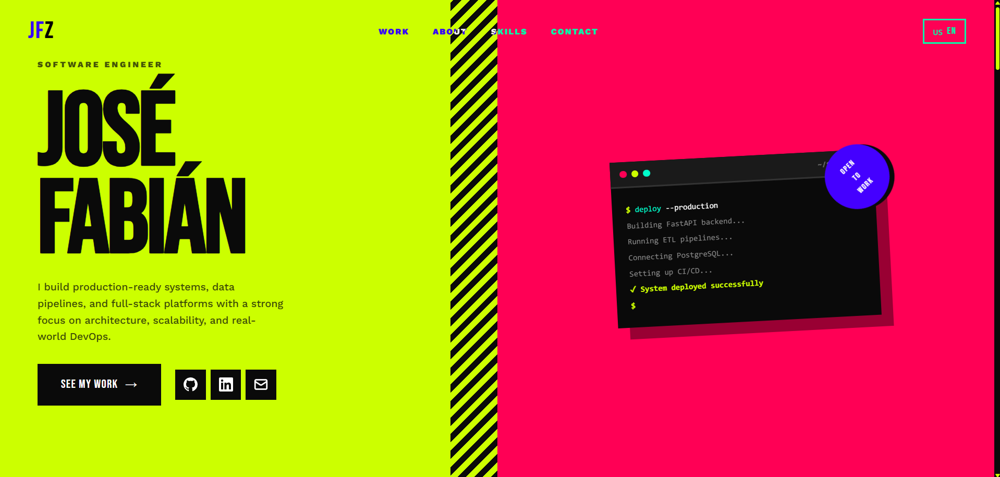

# Portfolio - José Fabián Zumbado Ruiz

Software Engineer portfolio showcasing production-ready systems, data pipelines, and full-stack platforms.

## Features

- **Bold Maximalist Design** - Vibrant colors and memorable visual identity
- **Bilingual Support** - English and Spanish (i18n)
- **Fully Responsive** - Mobile-first design
- **Modern Animations** - Smooth scrolling, marquees, and reveals
- **Tech Stack Showcase** - Interactive technology carousel
- **Production Ready** - Optimized for performance and SEO

## Tech Stack

- **Frontend**: Vanilla JavaScript, HTML5, CSS3
- **Fonts**: Bebas Neue, Work Sans (Google Fonts)
- **Icons**: DevIcons CDN
- **Hosting**: Vercel
- **Version Control**: Git

## License

© 2024 José Fabián Zumbado Ruiz. All rights reserved.

## Contact

- **Email**: josezumbru@gmail.com
- **GitHub**: [@JoseZum](https://github.com/JoseZum)
- **LinkedIn**: [José Fabián Zumbado Ruiz](https://linkedin.com/in/jos%C3%A9-fabi%C3%A1n-zumbado-ruiz-4ba737368)

---

**Built by José Fabián Zumbado**
